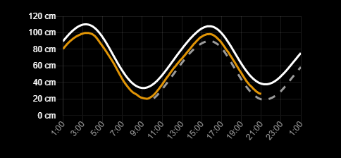
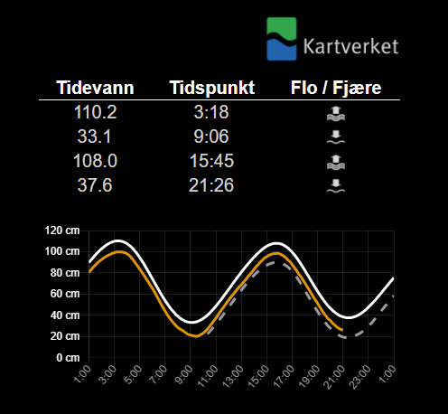

# MMM-FloGraph

This is a module for [Magic Mirror²](https://github.com/MichMich/MagicMirror) that will collect data from Kartverket in Norway and display a tide table.

The module can be configured to show several days and a spesific location.

The module uses XML data format from Kartverket in Norway.
Please see [Kartverket](http://api.sehavniva.no/tideapi_no.html) for details.

## Installation

Clone this repository in your `modules` folder, and install dependencies:
```bash
cd ~/MagicMirror/modules # adapt directory if you are using a different one
git clone https://github.com/kagjerde/MMM-FloGraph.git
cd MMM-FloGraph
npm install # this can take a while
```
## Screenshot



When used in combination with the "siste" module MMM-Flo, the display will show both the table and graph:


## Configuration

Add the module to your modules array in your `config.js`.
```
	{
			module: "MMM-FloGraph",
			position: "top_right", //top_bar, top_left, top_center, top_right, upper_third, middle_center, lower_third, bottom_left, bottom_center, bottom_right, bottom_bar, fullscreen_above, and fullscreen_below
			config: {
				refreshInterval: 5 * 60 * 1000, // every 5 minutes
				daysSpan:1,
				lat:60.260283,
				lon:5.321504,
				datatype:"all", //all, obs, pre, tab
			}
        }, 
```

## Credits

The module is based on the [MMM-HTTPRequestDisplay](https://github.com/Eunanibus/MMM-HTTPRequestDisplay) By Eunan Camilleri, and [MMM-dynchart](https://github.com/qistoph/MMM-dynchart)
module by Chris van Marle

## License

### The MIT License (MIT)

Copyright © 2019 KAG

Permission is hereby granted, free of charge, to any person
obtaining a copy of this software and associated documentation
files (the “Software”), to deal in the Software without
restriction, including without limitation the rights to use,
copy, modify, merge, publish, distribute, sublicense, and/or sell
copies of the Software, and to permit persons to whom the
Software is furnished to do so, subject to the following
conditions:

The above copyright notice and this permission notice shall be
included in all copies or substantial portions of the Software.

**The software is provided “as is”, without warranty of any kind, express or implied, including but not limited to the warranties of merchantability, fitness for a particular purpose and noninfringement. In no event shall the authors or copyright holders be liable for any claim, damages or other liability, whether in an action of contract, tort or otherwise, arising from, out of or in connection with the software or the use or other dealings in the software.**


